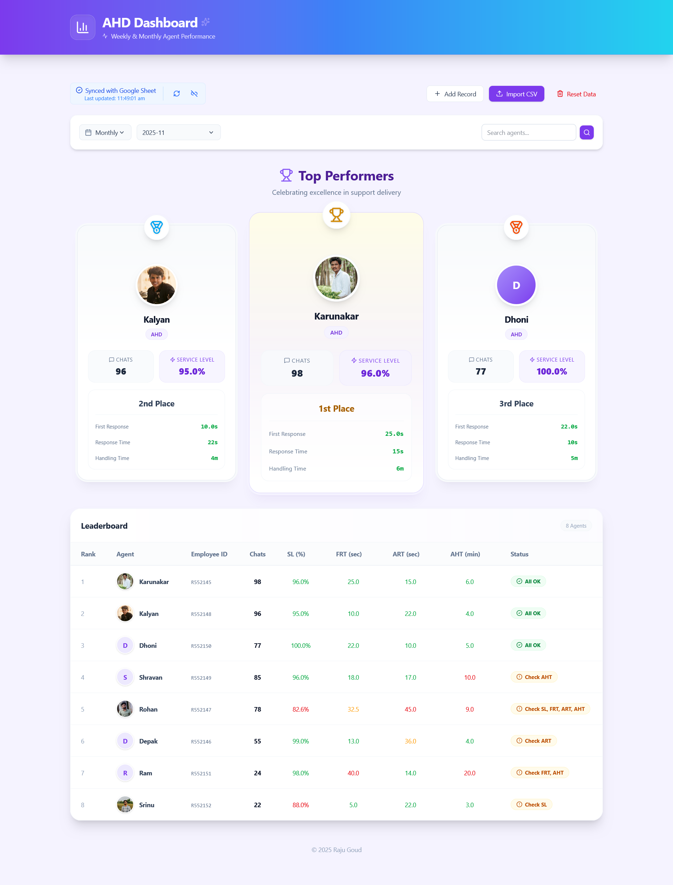

# 🚀 AHD Performance Dashboard


A modern, interactive dashboard designed to track, visualize, and optimize the performance of AHD support agents. Built with a focus on usability, aesthetics, and real-time data insights.

---

## 🎯 Project Goal

The primary goal of the **AHD Performance Dashboard** is to empower team leads and stakeholders with a transparent, data-driven view of support operations. By consolidating metrics like **Service Level (SL)**, **First Response Time (FRT)**, and **Average Handle Time (AHT)** into a unified interface, this project aims to:

*   **Identify Top Talent**: Automatically highlight high-performing agents with a dynamic podium system.
*   **Track Trends**: Visualize performance over weeks and months to spot improvement areas.
*   **Simplify Reporting**: Replace manual spreadsheet crunching with automated aggregation and easy CSV imports.
*   **Enhance Motivation**: Foster healthy competition through a gamified leaderboard experience.

---

## ✨ Features

*   **📊 Interactive Leaderboard**: deeply sortable table displaying critical KPIs (Chats, SL, FRT, ART, AHT).
*   **🏆 Top Performers Podium**: A visually distinct, animated podium showcasing the top 3 eligible agents.
*   **📅 Time-Based Filtering**: Seamlessly toggle between weekly breakdowns and monthly aggregated views.
*   **📈 Smart Aggregation**: Monthly data is automatically calculated using weighted averages for accuracy.
*   **📥 Robust Data Import**:
    *   **Drag-and-Drop CSV**: Effortless file uploads.
    *   **URL Import**: Connect directly to published Google Sheets.
    *   **CRUD Operations**: Manually add, edit, or delete agent records on the fly.
*   **💾 Persistent Storage**: Secure, local browser storage ensures data is never lost on refresh.
*   **🎨 Premium UI/UX**:
    *   Glassmorphism design aesthetic.
    *   Responsive layout for mobile and desktop.
    *   Smooth, physics-based animations.

---

## 📸 Dashboard Preview



---

## 🛠️ Tech Stack

*   **Framework**: [React 18](https://reactjs.org/)
*   **Language**: [TypeScript](https://www.typescriptlang.org/)
*   **Styling**: [Tailwind CSS](https://tailwindcss.com/)
*   **Build Tool**: [Vite](https://vitejs.dev/)
*   **Icons**: [Lucide React](https://lucide.dev/)
*   **Utilities**: `clsx`, `tailwind-merge`, `date-fns`, `papaparse`

---

## 🚀 Getting Started

Follow these steps to set up the project locally on your machine.

### Prerequisites

*   **Node.js** (v16 or higher)
*   **npm** or **yarn**

### Installation

1.  **Clone the repository**
    ```bash
    git clone <your-repo-url>
    cd performance
    ```

2.  **Install dependencies**
    ```bash
    npm install
    ```

3.  **Start the development server**
    ```bash
    npm run dev
    ```

    The app will typically run at `http://localhost:5173`.

---

## 📄 CSV Data Format

To import data effectively, ensure your CSV file matches the following schema. The order of columns does not matter.

| Header | Description | Example |
| :--- | :--- | :--- |
| `agentId` | Unique Employee ID | `R552145` |
| `agentName` | Full Name | `John Doe` |
| `role` | Role (Must be 'AHD') | `AHD` |
| `week` | Week Identifier (ISO Format) | `2025-W45` |
| `month` | Month Identifier (YYYY-MM) | `2025-11` |
| `numberOfChats` | Total Chats Taken | `98` |
| `slPercentage` | Service Level % | `96.0` |
| `frtSeconds` | First Response Time (s) | `25.0` |
| `artSeconds` | Avg Response Time (s) | `15.0` |
| `ahtMinutes` | Avg Handle Time (min) | `6.0` |
| `imageUrl` | Profile Picture URL (Optional) | `https://example.com/pic.jpg` |

> **Note**: You can also use shorthand headers: `sl`, `frt`, `art`, `aht`.

---

## 📜 License

© 2025 Raju Goud. All rights reserved.
